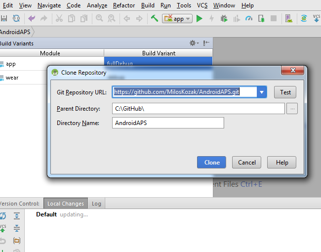

# Installing AndroidAPS - Build the APK

AndroidAPS and Ruffy come in the form of a source code that you have to download and compile using Android Studio. The process is not difficult once you have worked out what to do.

You will need to download a local copy of the source code folders (called a repository) onto your PC. There are a number of ways you can do this:

* **Install GitHub desktop** (recommended) on your PC. This will download the repository for you and automatically download any updates that occur in the future. 

* **Use the "clone" function in Android Studio** to download a copy of the repository directly into Android Studio. This works well but you will need to repeat the process each time there are future updates.

* **Download the repository as a zip file** and then unzip the folders and use those as the source for Android Studio. 

In all cases you will need to install [Android Studio](https://developer.android.com/studio/install.html). You will find instructoins how to do this on their website. Once you have installed it you may find that it wants to install various updates - you need to do this.

We will look first at using the clone function in Android Studio, as per the following screenshot:

You then enter the URL of the repository you want to download. In this case AndroidAPS, but if you are using a Combo you will need to do the same process for Ruffy as well.

* In Android Studio click on "File" and select 'Open an existing Android Studio project'. selecting the location of the extracted files.

* You might get an error message about not finding build tools - click on the links Android Studio provides to download all the suggested software updates.
 
* Go to Build Menu and click on Generate Signed APK

* Select 'app' as Module

* Set a keystore and password, if this is your first time then Create new, or fill in the details of your existing one.  For more information about using the keystore see [https://developer.android.com/studio/publish/app-signing.html#generate-key](https://developer.android.com/studio/publish/app-signing.html#generate-key)

* 'Release' should be your default choice for "Build Type", 'Debug' is just for people coding.
* Select the build type you want to build. 
    * full (i.e. recommendations automatically enacted in closed looping)
    * openloop (i.e. recommendations given to user to manually enact)
    * pumpcontrol (i.e. remote control for pump, no looping)
    * nsclient (i.e. looping data of another user is displayed and careportal entries can be added)

*   Select V1 "Jar Signature" (V2 is optional) and click Finish. 

* Please wait for some time until the APK is created. You will get the pop-up below when the process is done.

* Click on 'Show in Explorer'. You'll find the APK is generated, sometimes it may take time to display.

* Copy the APK with the same filename as the buildtype you chose to your android phone, and install it.  If the apk does not install and you have an older version of AndroidAPS on your phone that was signed with a different key then you will need to uninstall this first, remember to export your settings if so.
