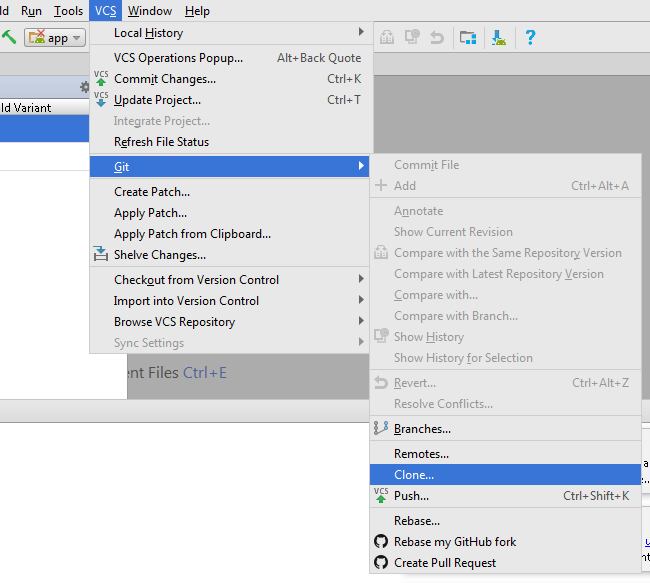
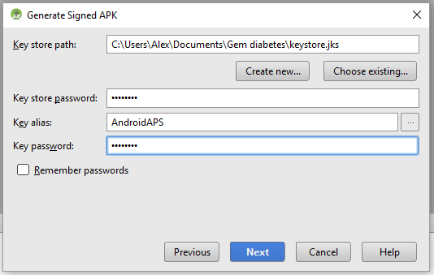

# Installing AndroidAPS - Build the APK

* Install [Android Studio](https://developer.android.com/studio/install.html).  
* Use git clone in Android Studio as shown in screenshot below.

* Run Android Studio and select 'Open an existing Android Studio project', selecting the location of the extracted files.

* You might get an error message about not finding build tools - click on the links Android Studio provides to download all the software updates suggested.
 
* Go to Build Menu and click on Generate Signed APK

* Select 'app' as Module

* Set a keystore and password, if this is your first time then Create new, or fill in the details of your existing one.  For more information about using the keystore see [https://developer.android.com/studio/publish/app-signing.html#generate-key](https://developer.android.com/studio/publish/app-signing.html#generate-key)

* 'Release' should be your default choice for "Build Type", 'Debug' is just for people coding.
* Select the build type you want to build. 
    * full (i.e. recommendations automatically enacted in closed looping)
    * openloop (i.e. recommendations given to user to manually enact)
    * pumpcontrol (i.e. remote control for pump, no looping)
    * nsclient (i.e. looping data of another user is displayed and careportal entries can be added)

*   Select V1 "Jar Signature" (V2 is optional) and click Finish. 

* Please wait for some time until the APK is created. You will get the pop-up below when the process is done.

* Click on 'Show in Explorer'. You'll find the APK is generated, sometimes it may take time to display.

* Copy the APK with the same filename as the buildtype you chose to your android phone, and install it.  If the apk does not install and you have an older version of AndroidAPS on your phone that was signed with a different key then you will need to uninstall this first, remember to export your settings if so.
